# 🦴 Virtual Tour of the Musculoskeletal System  

**Final Project – SBES140: Computer Graphics and Visualization**  
Group Size: 5 Students  
Tool Used: Blender  

---

## 📜 Project Overview  
This project presents an interactive **virtual museum tour** of the **human musculoskeletal system** using Blender. It is designed for medical education and features animated characters, anatomical models, disease visualizations, and a realistic environment.

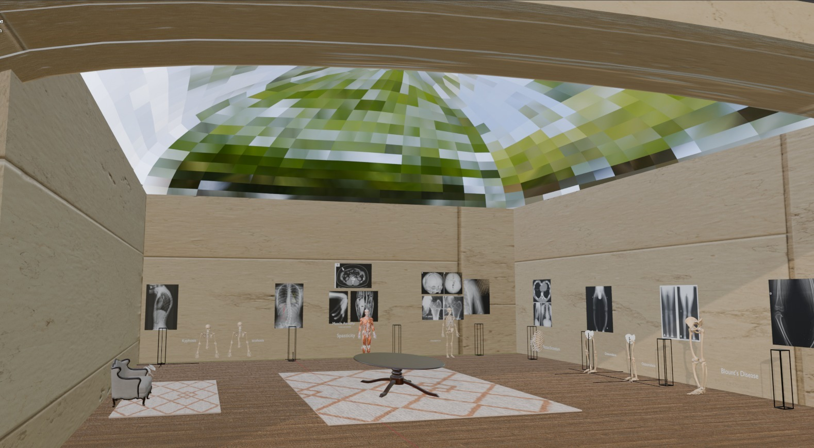
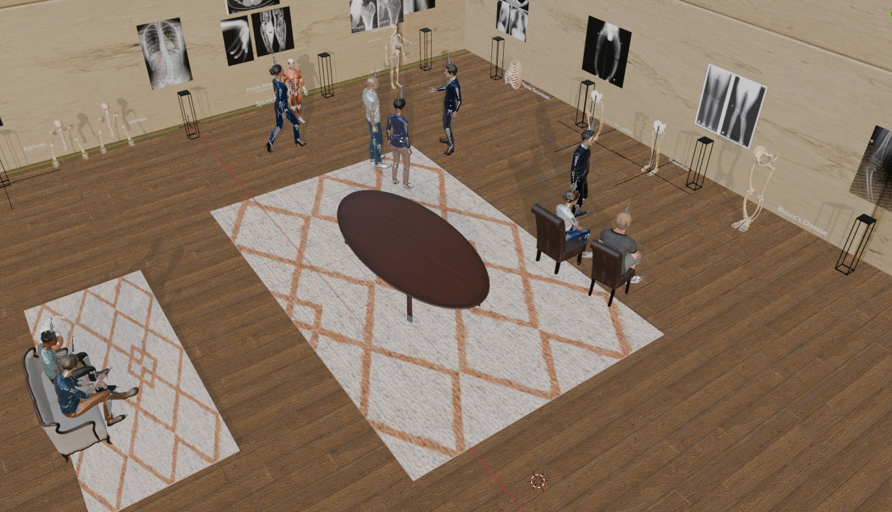
---

## 🧠 Objectives  
- Create a virtual environment for exploring a major human organ system  
- Animate characters (guides and visitors) with realistic motions and interactions  
- Model and animate anatomical abnormalities/diseases  
- Simulate real-world environments with accurate textures and lighting  
- Provide an educational yet immersive experience  

---

## 🏛️ Environment & Scene Description  
- The virtual museum features a **wooden panel floor**, **beige tiled walls**, and a **glass dome ceiling**.  
- Decorative elements include:
  - 🪴 A **potted plant**
  - 🪑 A **couch and two chairs**
  - 🧶 **Two rugs**
  - 🪵 A **wooden table**
- All models are textured for realism using high-quality sources (see Assets below).  
- The glass dome allows natural light to enter, enhancing the realism and atmosphere.  

---

## 🦴 Anatomical Figures and Diseases Visualized  
There are **8 anatomical figures**, visualizing **11 diseases/abnormalities**:

1. **Skeletal Upper Bodies**
   - Kyphosis  
   - Scoliosis 

   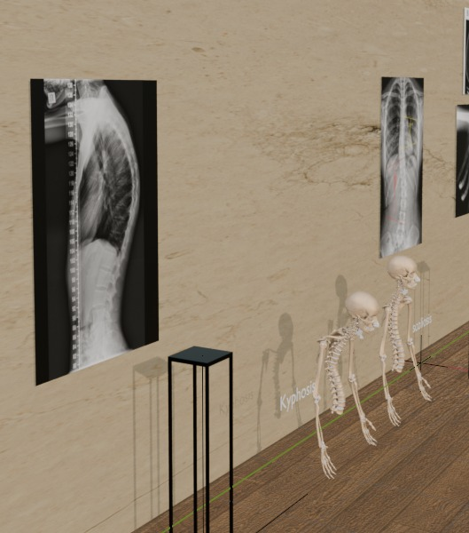 
   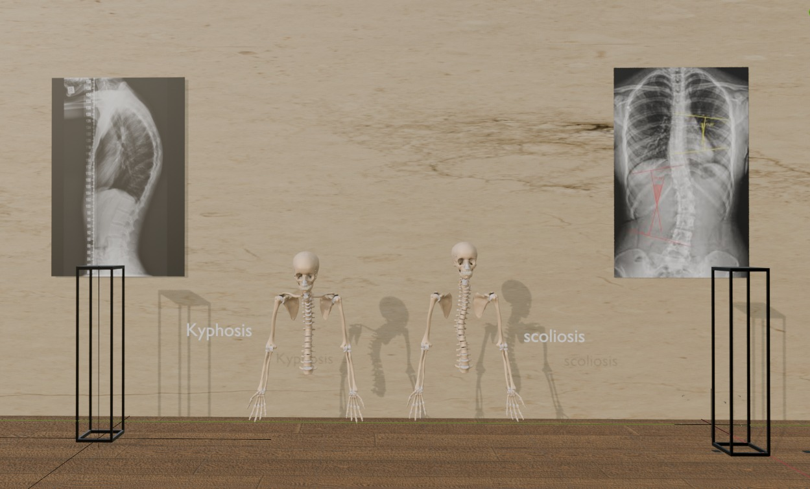 
   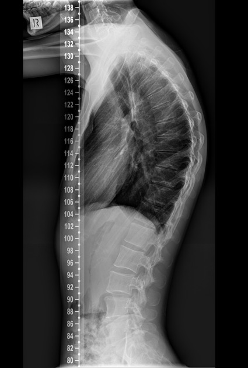
   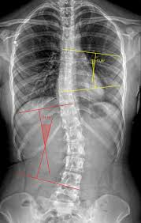


2. **Full Muscle System**
   - Abdominal muscle atrophy  
   - Calf pseudohypertrophy  
   - Muscle spasticity (right hand)

    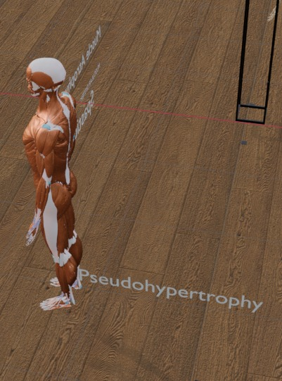 
    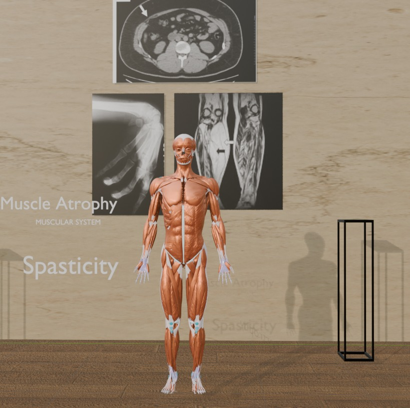 
    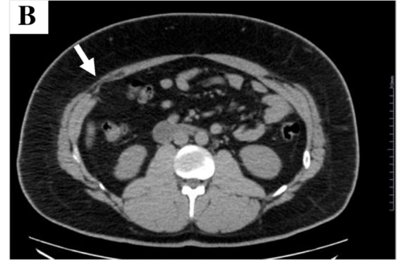 
    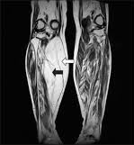
    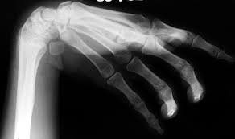

3. **Full Skeletal System**
   - Osteoporosis (femur)  
   - Bone metastasis (humerus)  
   - Congenital skull disorders  

    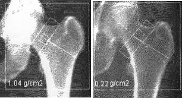
    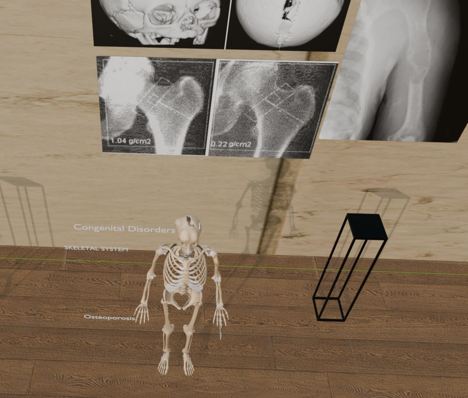
    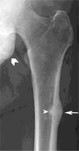
    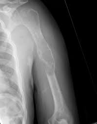
    
   

4. **Rib Cage**
   - Pectus excavatum 

    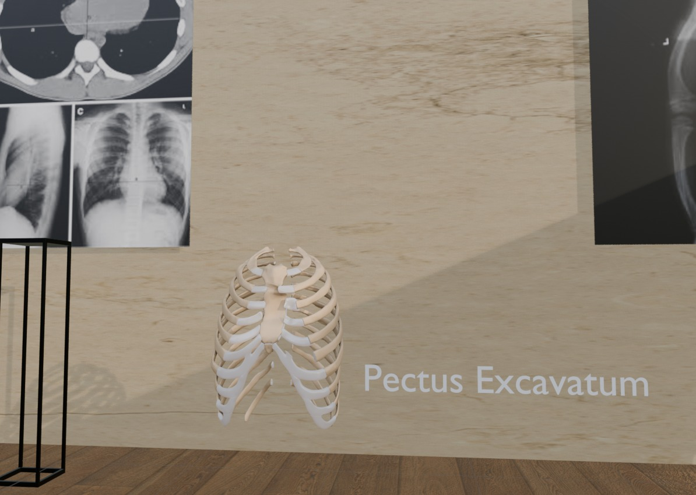 
    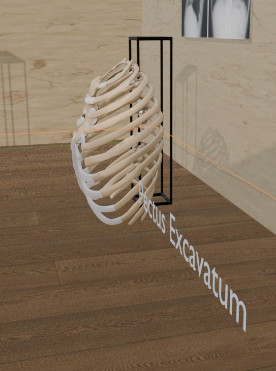 
    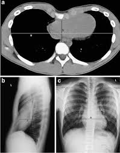 

5. **Two Lower Limb Skeletons**
   - Osteomalacia: inward bone curvature  
   - Osteomalacia: outward bone curvature  

    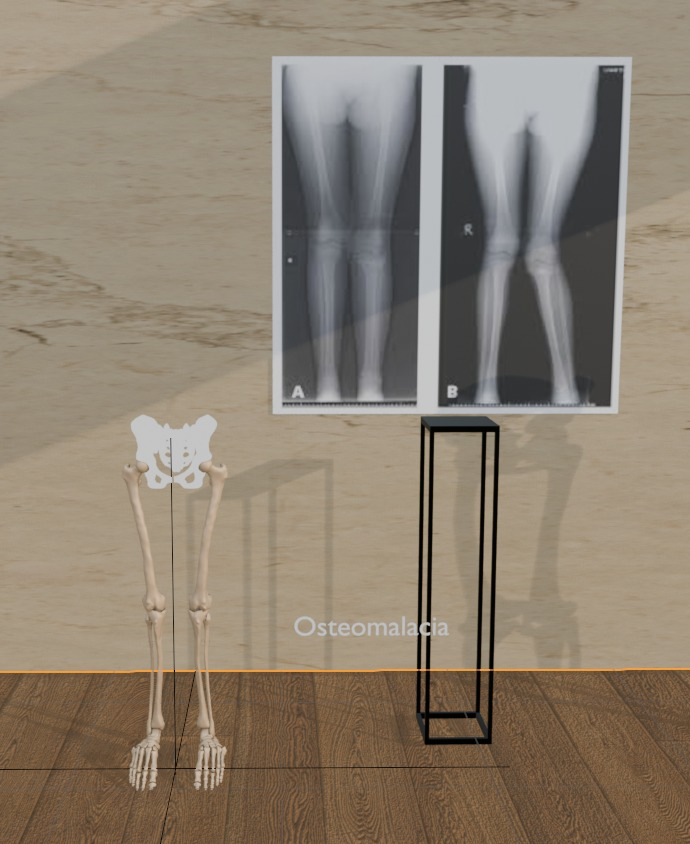 
    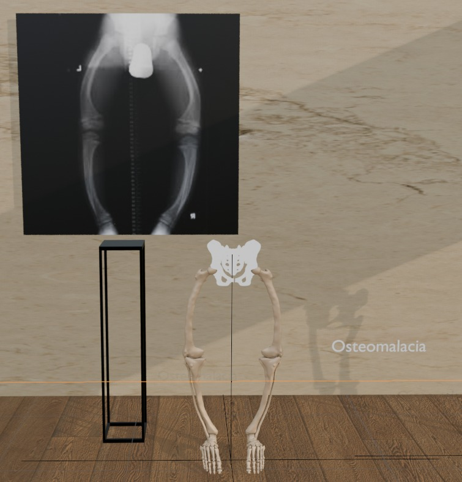
    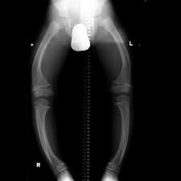 
    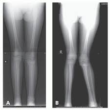

6. **Lower Limb Skeleton**
   - Blount’s disease 

   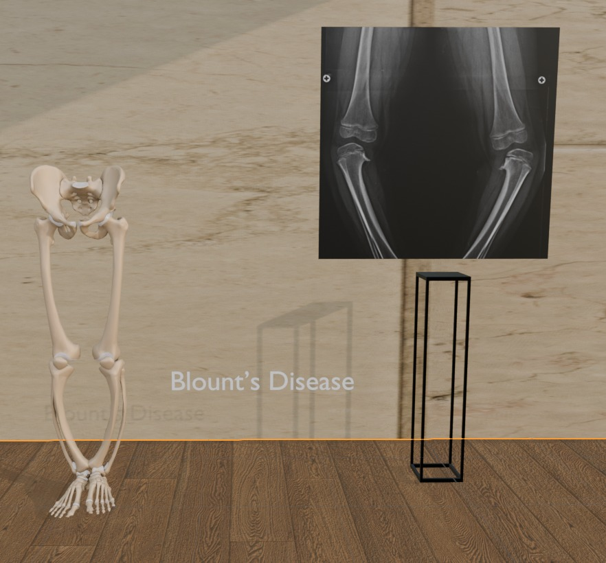  
   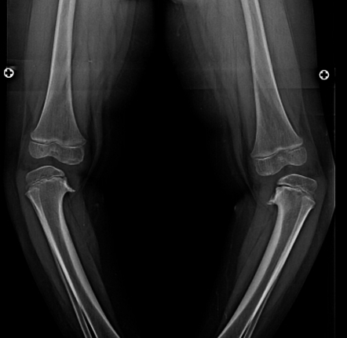

Each figure is accompanied by an **X-ray image or MRI** of the corresponding condition displayed on the museum wall.

  
---

## 🧍‍♂️ Animated Characters  
A total of **9 characters** are animated in the scene:

- 👥 Two people sitting on a couch having a conversation  
- 🪑 Two visitors and one tour guide seated and engaged in explanation  
- 🧍‍♀️ Three-person standing tour: two visitors and a guide (gesturing/talking)  
- 🚶‍♀️ One woman walking along a path, viewing figures  

---

## 💡 Lighting and Materials  
- The environment uses a **single Sun lamp**, positioned outside the **glass dome** to simulate natural daylight.  
- Materials range from **highly diffuse** (e.g. plaster) to **highly specular** (e.g. glass dome).  
- All objects and characters are textured to maximize realism.

---

## ⚙️ Assets Used  
- **Textures**:
  - Floor and wall textures: [Polyhaven](https://polyhaven.com/)  
  - Rug texture: [TextureCan](https://www.texturecan.com/)  

- **Models**:
  - Table, couch, plant: Polyhaven  
  - Human characters and animations: [Mixamo](https://www.mixamo.com/)  
  - Anatomical figures: [Z-Anatomy](https://drive.google.com/file/d/1gJYDJ2qTf1oqGo2_a3o_ywDcRtkciQ4t/view), BlenderKit  
    - Sculpted and modified in Blender to show abnormalities

---

## 🧪 How to Open the Project  
1. Install **Blender** (version 3.0 or higher recommended)  
2. Open the file `animations.blend`  for the people animations with the anatomical figures
3. Open the file `museum.blend`  for the full museum and the anatomical figures
4. Open the file `Best.blend` for everything together
5. Press `Spacebar` to play the animation  
6. Use `F12` to render a frame or `Ctrl+F12` to render the full animation  

---

## 🗃️ File Structure  

```
/Team5_VirtualTourProject/
│
├── animations.blend # people animations with the anatomical figures
├── museum.blend # full museum and the anatomical figures without people and animations
├── Best.blend # for everything together
├── demo_video.mp4 # Recorded walkthrough
├── textures/ # Folder with image textures
│ ├── fabrics_0077_ao_2k.jpg
│ ├── fabrics_0077_color_2k.jpg
│ ├── fabrics_0077_height_2k.png
│ ├── fabrics_0077_normal_directx_2k.png
│ ├── fabrics_0077_normal_opengl_2k.png
│ ├── fabrics_0077_roughness_2k.jpg
│ ├── marble_01_diff_4k.jpg
│ ├── marble_01_disp_4k.png
│ ├── marble_01_nor_gl_4k.exr
│ ├── marble_01_rough_4k.jpg
│ ├── wood_floor_diff_4k.jpg
│ ├── wood_floor_disp_4k.png
│ ├── wood_floor_nor_gl_4k.exr
│ └── wood_floor_rough_4k.exr
├── xray_images/ # X-rays or MRIs of abnormalities
│ ├── kyphosis.png
│ ├── abdominal_atrophy.png
│ ├── blunt.jpeg
│ ├── bone_metastasis.jpg
│ ├── calf_pseudohypertrophy.jpg
│ ├── Humerus_Metastasis.jpg
│ ├── kyphosis.jpeg
│ ├── osteoporosis.jpg
│ ├── pectus_excavatum.jpg
│ ├── pronated_arm_spasticity.jpg
│ ├── rickets1.jpg
│ ├── rickets2.jpg
│ └── scoliosis.jpg
└── README.md # This README file
```


---
## 🤝 Member Contributions  
| Name                          | Contribution                                                                 |
|-------------------------------|------------------------------------------------------------------------------|
| Maryam Mohamed Aly 1220315    | Modeled anatomical figures (muscles and skeletons), sculpted disease states <br> Research on musculoskeletal abnormalities, gathered reference X-rays |
| Mena Hesham Ragab 1220321     | Animated characters (Mixamo integration and path-following logic)            |
| Manal Hady Abdelfattah 1220103    | Modeled anatomical figures (muscles and skeletons), sculpted disease states <br> Research on musculoskeletal abnormalities, gathered reference X-rays |
| Farah Ahmed Kamal 4230162     | Set up scene layout, museum architecture, environmental textures and Lighting |
| Salma Mohamed Saad 4230195    | Set up scene layout, museum architecture, environmental textures and Lighting |


---

## 🧭 Future Improvements  
- Add voice narration for guided tours  
- Include interactive elements (e.g. clickable figures for info pop-ups)  
- Expand to cover additional body systems and organs  

---

## 📑 License & Credits  
This project uses public and free-to-use models and textures from:  
- Polyhaven  
- TextureCan  
- Mixamo  
- Z-Anatomy  
- BlenderKit  

All custom models and animations were created by the project team.

---

